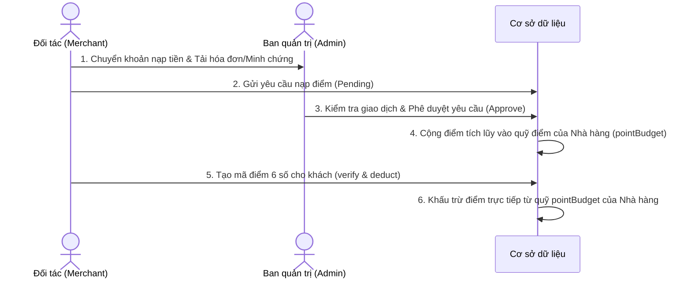

# Kế hoạch Thiết kế Tính năng Nạp tiền & Cấp Quỹ điểm cho Merchant từ Admin

Tài liệu này phác thảo kế hoạch phát triển hệ thống cho phép đối tác nhà hàng (Merchant) nạp tiền (offline/online) và gửi yêu cầu xin cấp hạn mức quỹ điểm tích luỹ (Point Quota/Budget) từ Ban quản trị (Admin). Quỹ điểm này dùng để trừ dần mỗi khi Merchant phát hành mã điểm 6 số cho khách hàng.

---

## 1. Cơ chế Quản lý & Quy trình Nghiệp vụ (Business Flow)



1. **Merchant Nạp tiền:**
   * Merchant chọn gói điểm tương ứng trên Dashboard (ví dụ: Gói 1.000 điểm = 100.000đ, Gói 10.000 điểm = 1.000.000đ).
   * Merchant thực hiện thanh toán (chuyển khoản ngân hàng qua mã QR) và chụp ảnh minh chứng giao dịch (Payment Proof).
2. **Gửi yêu cầu xin cấp điểm:**
   * Merchant tải ảnh chuyển khoản lên hệ thống và gửi yêu cầu cấp điểm.
   * Hệ thống ghi nhận yêu cầu ở trạng thái `PENDING`.
3. **Admin phê duyệt:**
   * Admin nhận thông báo, kiểm tra tài khoản ngân hàng và đối chiếu ảnh minh chứng.
   * Nếu giao dịch hợp lệ, Admin bấm **Duyệt (Approve)**.
   * Hệ thống sẽ tự động cộng số điểm tương ứng vào **Quỹ điểm (pointBudget)** của nhà hàng đó, đồng thời chuyển trạng thái yêu cầu sang `APPROVED`.
4. **Khấu trừ quỹ điểm khi Merchant tạo mã:**
   * Khi nhà hàng dùng tính năng tạo mã điểm 6 số cho khách, hệ thống sẽ kiểm tra:
     * Nếu số điểm của mã lớn hơn số dư `pointBudget` hiện tại -> Từ chối tạo và yêu cầu nạp thêm tiền.
     * Nếu đủ -> Trừ trực tiếp điểm từ `pointBudget` và tạo mã điểm.

---

## 2. Thiết kế Cơ sở dữ liệu (Database Schema)

Cần thực hiện cập nhật các model trong tệp [schema.prisma](file:///e:/FOOD_AI_code/my-web/backend/prisma/schema.prisma):

```prisma
// 1. Cập nhật model Restaurant để thêm lưu trữ số dư quỹ điểm
model Restaurant {
  id          Int       @id @default(autoincrement())
  name        String
  // ... các trường cũ giữ nguyên ...
  
  // Bổ sung: Số dư quỹ điểm tích lũy hiện có của nhà hàng (mặc định bằng 0)
  pointBudget Int       @default(0) @map("point_budget")

  // Quan hệ với bảng yêu cầu nạp tiền
  depositRequests PointDepositRequest[]
}

// 2. Tạo model mới ghi nhận lịch sử nạp tiền & cấp điểm
model PointDepositRequest {
  id              String        @id @default(uuid())
  restaurantId    Int           @map("restaurant_id")
  amount          Float         // Số tiền thực nạp (VND)
  pointsRequested Int           @map("points_requested") // Số điểm yêu cầu tương ứng
  status          DepositStatus @default(PENDING) // Trạng thái yêu cầu
  paymentProof    String?       @map("payment_proof") // Link ảnh minh chứng chuyển khoản
  notes           String?       // Ghi chú của Merchant hoặc Admin
  createdAt       DateTime      @default(now()) @map("created_at")
  updatedAt       DateTime      @updatedAt @map("updated_at")
  approvedById    Int?          @map("approved_by_id") // Admin thực hiện duyệt
  
  restaurant      Restaurant    @relation(fields: [restaurantId], references: [id], onDelete: Cascade)
  approvedBy      User?         @relation(fields: [approvedById], references: [id], onDelete: SetNull)

  @@map("point_deposit_requests")
}

// 3. Trạng thái giao dịch nạp tiền
enum DepositStatus {
  PENDING
  APPROVED
  REJECTED
}
```

---

## 3. Thiết kế các Endpoint API (Backend)

Cần xây dựng trong module `voucher` hoặc tạo module mới `point-budget`:

### Phân hệ Merchant (Merchant APIs):
* `POST /point-budget/deposit-request`
  * **Mô tả:** Gửi yêu cầu nạp tiền cấp quỹ điểm.
  * **Payload:** `{ amount: number, pointsRequested: number, paymentProofUrl: string, notes?: string }`
* `GET /point-budget/my-requests`
  * **Mô tả:** Lấy danh sách lịch sử nạp tiền của nhà hàng (hỗ trợ phân trang, lọc theo trạng thái).
* `GET /point-budget/balance`
  * **Mô tả:** Lấy số dư `pointBudget` hiện tại của cửa hàng.

### Phân hệ Quản trị (Admin APIs):
* `GET /admin/point-budget/requests`
  * **Mô tả:** Lấy danh sách tất cả các yêu cầu nạp tiền đang ở trạng thái `PENDING` của hệ thống.
* `POST /admin/point-budget/requests/:id/approve`
  * **Mô tả:** Duyệt nạp tiền. Thực hiện cộng điểm tích lũy vào `pointBudget` của Restaurant tương ứng và đánh dấu trạng thái `APPROVED` trong một transaction.
* `POST /admin/point-budget/requests/:id/reject`
  * **Mô tả:** Từ chối yêu cầu nạp tiền (yêu cầu điền lý do từ chối vào trường `notes`).

---

## 4. Thiết kế Giao diện Người dùng (Frontend)

### Giao diện cho Merchant Dashboard:
1. **Trang Quản lý Quỹ Điểm (Point Balance Page):**
   * Hiển thị widget số dư quỹ điểm hiện tại nổi bật (màu vàng/amber bắt mắt).
   * Bảng lịch sử các yêu cầu nạp điểm (chứa thông tin: Ngày yêu cầu, số tiền, số điểm nhận được, minh chứng hình ảnh, trạng thái: Đang duyệt / Đã cộng điểm / Bị từ chối).
2. **Form Yêu Cầu Nạp Điểm (Deposit Request Form):**
   * Giao diện chọn các gói điểm khuyến nghị kèm tỉ giá quy đổi (ví dụ: Nạp 500k VNĐ nhận 5000 điểm).
   * Hướng dẫn chuyển khoản ngân hàng (Hiển thị Số tài khoản của Admin hệ thống hoặc mã QR VietQR tự động sinh theo số tiền chọn).
   * Ô upload ảnh minh chứng chuyển khoản (sử dụng kéo thả ảnh trực quan).

### Giao diện cho Admin Dashboard:
1. **Trang Phê Duyệt Quỹ Điểm (Admin Deposit Approval Page):**
   * Hiển thị danh sách các yêu cầu nạp tiền đang đợi xử lý dưới dạng lưới (Grid) hoặc bảng (Table).
   * Cột hiển thị ảnh thu nhỏ minh chứng giao dịch, nhấp vào sẽ phóng to màn hình (Lightbox) để kiểm tra giao dịch chi tiết.
   * Cặp nút thao tác trực tiếp: **"Xác nhận đã nhận tiền (Duyệt)"** và **"Từ chối yêu cầu"** (mở popup điền lý do).
