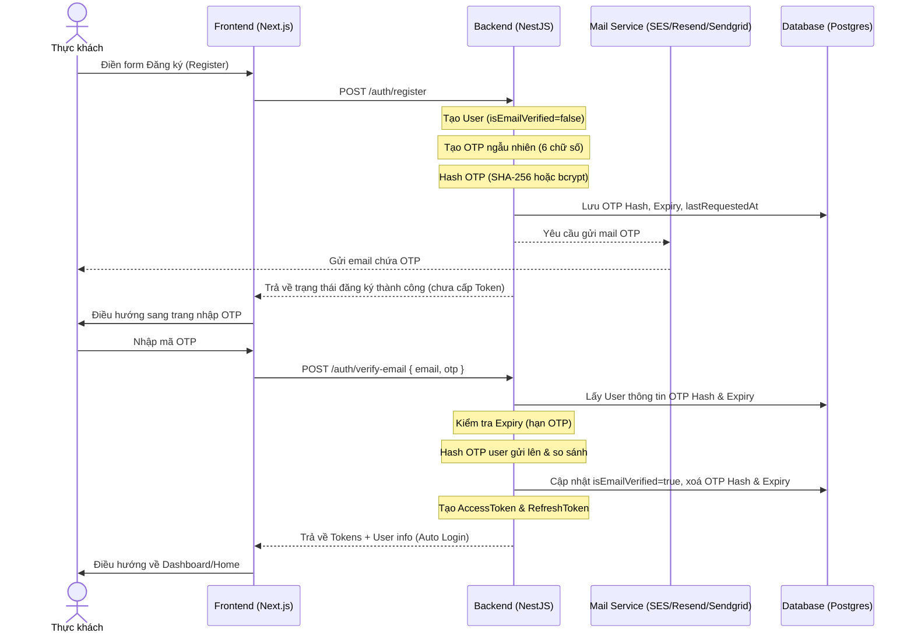

# Kế hoạch triển khai: Xác thực tài khoản qua Email (Task 1.5 & US-06)

Tài liệu này lưu trữ phương án thiết kế hệ thống xác thực email sử dụng mã OTP cho dự án FOOD AI. Tính năng này được tạm hoãn trong Sprint 1 và sẽ được thực hiện sau.

---

## 1. Thiết kế Luồng Nghiệp vụ (Business Flow)



---

## 2. Các Quy tắc Bảo mật & Thiết kế Kỹ thuật (Technical Specification)

### 2.1. Tách Trường Cơ sở dữ liệu Rõ nghĩa (Database Fields)
Thay vì sử dụng một trường `verificationToken` chung chung, chúng ta sẽ mở rộng bảng `User` trong Prisma schema:
- `verificationOtpHash`: Lưu chuỗi mã hóa (SHA-256/Bcrypt) của mã OTP 6 số. Không bao giờ lưu Plain Text OTP để tránh rò rỉ dữ liệu.
- `verificationOtpExpiresAt`: Thời gian hết hạn của OTP (Ví dụ: `createdAt + 5 minutes`).
- `lastOtpRequestedAt`: Lưu mốc thời gian yêu cầu OTP gần nhất để xử lý Rate Limit.

### 2.2. Thời gian hết hạn OTP (OTP Expiry)
- OTP chỉ có hiệu lực trong vòng **5 phút** kể từ lúc tạo.
- Khi verify, hệ thống kiểm tra: `new Date() < user.verificationOtpExpiresAt`. Nếu quá hạn, trả về lỗi `400 Bad Request (OTP expired)`.

### 2.3. Giới hạn tần suất gửi (Rate Limiting & Resend OTP)
- Tạo API `POST /auth/resend-otp { email }`.
- Kiểm tra Rate Limit: Khoảng cách giữa 2 lần bấm gửi OTP tối thiểu là **60 giây**.
  - Logic: Kiểm tra `new Date() - user.lastOtpRequestedAt < 60000ms`. 
  - Nếu vi phạm, trả về lỗi `429 Too Many Requests`.
- Khi vượt qua kiểm tra, hệ thống sinh OTP mới, hash lại, cập nhật Expiry mới và cập nhật `lastOtpRequestedAt = new Date()`.

### 2.4. Dọn dẹp OTP sau khi Verify (Clear OTP)
- Ngay sau khi người dùng nhập đúng OTP và hệ thống đổi `isEmailVerified = true`, các trường `verificationOtpHash` và `verificationOtpExpiresAt` bắt buộc phải được cập nhật về `null` trong Database.
- Mục đích: Ngăn chặn replay attacks (tấn công sử dụng lại OTP cũ).

### 2.5. Tự động đăng nhập (Auto Login)
- Khi API `/auth/verify-email` xác thực thành công, Backend sẽ lập tức tạo cặp Access Token / Refresh Token và trả về thông tin User giống y hệt như API Đăng nhập.
- Frontend sẽ lưu Token vào HttpOnly Cookies / Zustand Store và tự động điều hướng người dùng thẳng vào trong hệ thống mà không cần bắt họ nhập lại mật khẩu một lần nữa.

### 2.6. Cấu hình Mail Server cho Production
- **Development/Staging:** Có thể sử dụng Gmail SMTP (App Password) hoặc các công cụ mock mail như Mailtrap để test.
- **Production:** Tuyệt đối không dùng Gmail SMTP vì dễ bị đưa vào danh sách spam, giới hạn lượt gửi thấp (500 mail/ngày). Chúng ta sẽ cấu hình biến môi trường sử dụng dịch vụ chuyên dụng:
  - **Resend** (Khuyên dùng cho startup: Giao diện hiện đại, dễ tích hợp NestJS, free 3000 mail/tháng).
  - **Amazon SES** (Khuyên dùng khi scale lớn: Rẻ nhất, độ tin cậy cao).
  - **SendGrid** / **Postmark**.

---

## 3. Các File cần chỉnh sửa khi triển khai

### [Backend]

#### 1. [MODIFY] `prisma/schema.prisma`
```prisma
model User {
  // ... các trường cũ
  isEmailVerified         Boolean   @default(false) @map("is_email_verified")
  verificationOtpHash     String?   @map("verification_otp_hash")
  verificationOtpExpiresAt DateTime? @map("verification_otp_expires_at")
  lastOtpRequestedAt      DateTime? @map("last_otp_requested_at")
  // ...
}
```

#### 2. [NEW] `src/modules/mail/mail.service.ts`
Chứa logic gửi mail sử dụng thư viện `nodemailer`. Provider (SMTP/API) được cấu hình linh động qua biến `.env`.

#### 3. [MODIFY] `src/modules/auth/auth.service.ts`
- Cập nhật hàm `register`:
  1. Sinh OTP 6 số ngẫu nhiên.
  2. Hash OTP bằng SHA-256.
  3. Lưu vào DB cùng Expiry (5 phút) và set `isEmailVerified = false`.
  4. Gửi email qua `mailService`.
  5. Trả về: `{ message: 'Đăng ký thành công. Vui lòng xác thực email.' }`
- Thêm hàm `verifyEmail(email, otp)`:
  1. So sánh hash OTP.
  2. Kiểm tra hết hạn.
  3. Cập nhật `isEmailVerified = true`, dọn dẹp các trường OTP.
  4. Gọi `generateToken(user)` để trả về Token đăng nhập tự động.
- Thêm hàm `resendOtp(email)`:
  1. Kiểm tra Rate Limit (60s).
  2. Sinh OTP mới, hash và lưu lại.
  3. Gửi email và cập nhật `lastOtpRequestedAt`.

#### 4. [MODIFY] `src/modules/auth/auth.controller.ts`
- Thêm `POST /auth/verify-email`
- Thêm `POST /auth/resend-otp`

---

### [Frontend]

#### 1. [NEW] `src/app/(auth)/verify-email/page.tsx`
Trang nhập OTP chứa:
- Form nhập 6 ô số.
- Nút "Gửi lại mã" (có đếm ngược 60 giây để tránh spam).
- Hàm gọi API `/auth/verify-email` -> Nếu thành công, lưu token vào store và chuyển hướng đến Dashboard.

#### 2. [MODIFY] `src/app/(auth)/register/page.tsx`
Sau khi submit đăng ký thành công, chuyển hướng người dùng sang `/verify-email?email={email}`.
